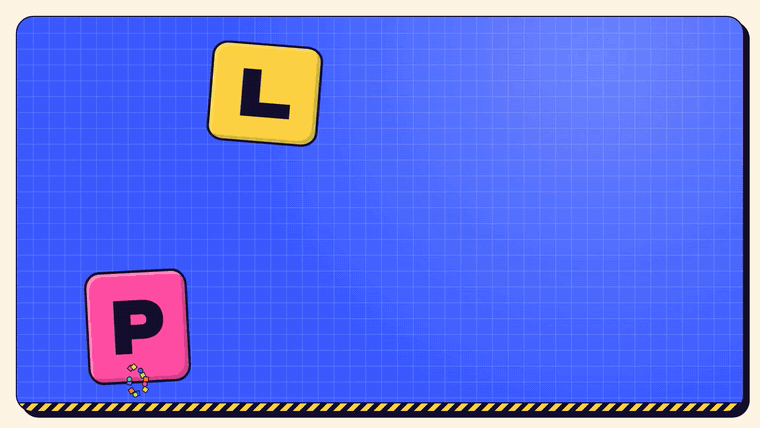

# plonk.

**Drop blocks. Build anything.**

Plonk is a drag-and-drop playground for **documents** and **websites**. Grab a brick, drop it on the page, style it till it sings, and watch every change land live. When you're done, export to PDF, Word, HTML, a ready-to-host website and more. Everything runs in your browser, with no account and no server.

<p align="center">
  <a href="docs/media/brag.mp4">
    
  </a>
  <br>
  <sub>▶ <a href="docs/media/brag.mp4"><b>Watch the full 23-second video (with sound)</b></a></sub>
</p>

---

## What you can make

| 📄 Documents | 🌐 Websites |
|---|---|
| Résumés, letters, reports, zines | Landing pages, portfolios, event pages |
| Paged paper (A4 / US Letter) with page-break guides | Multi-page sites with page tabs and an "All pages" overview |
| Contents (auto-built from headings), signature lines, footnotes, page breaks | Nav bar, hero, features, pricing, testimonial, FAQ, contact form, gallery, footer |
| Export: PDF (with page numbers), Word, HTML, PNG, Markdown, text, print | Export: website folder (.zip, one page per file), single-file site, PNG, PDF, Markdown, Word |

Both kinds of project share the everyday bricks: headings, paragraphs, lists, checklists, quotes, callouts, code, tags, big numbers, images, tables, sections, columns, cards, dividers and spacers.

## Features

- **Real drag & drop:** drag bricks from the Brick box and drop them exactly where the pink line shows, including inside columns, sections and cards. Or click a brick to add it after whatever is selected. Works with mouse, pen and touch.
- **Live editing:** type straight onto the page. Select text for bold, italic, underline, strikethrough and links.
- **Style anything:** one-click Quick looks (Sticker, Glass, Ink, Glow…), fonts, colours, gradients, borders, shadows and tilt, plus six themes (Plonk Pop, Paper Classic, Midnight, Mint Zine, Sunset, Ink & Bone).
- **Resize any block:** drag the pink handles, or set width, height and position in the panel.
- **Multi-page websites:** nav bars list every page automatically, and the nav bar and footer stay in sync across pages. Links work in the editor, in preview and in the exported site.
- **Tags your way:** wrap, tight, stack, grid or plain text, in pill, square, outline or solid styles.
- **Undo / redo, copy & paste blocks** (even between pages), and **autosave** in your browser.
- **Plonk files:** export a `.plonk.json` and reopen it later to keep editing.
- **Sound effects & confetti:** every drop goes *plonk* (you can mute it).

## Getting started

You need [Node.js](https://nodejs.org/) 18 or newer.

```bash
git clone https://github.com/A-J21/plonk.git
cd plonk
npm install
npm run dev
```

Open the address it prints (usually http://localhost:5173).

To build a static copy you can host anywhere:

```bash
npm run build
```

The site is written to `dist/`.

## Keyboard shortcuts

| Keys | What it does |
|---|---|
| `Enter` | New line inside the same paragraph |
| `Ctrl + Enter` | New paragraph block below |
| `Alt + ↑ / ↓` | Move the selected block. At the edge of a column it slides to the column's middle or bottom, then moves out of the columns block |
| `Ctrl + D` | Duplicate block |
| `Ctrl + C` / `Ctrl + V` | Copy / paste a block |
| `Del` | Delete block |
| `Ctrl + Z` / `Ctrl + Shift + Z` | Undo / redo |
| `P` | Toggle preview |
| `?` | Show all shortcuts |

## How it's built

Plain JavaScript with [Vite](https://vitejs.dev/). No UI framework.

```
src/
  main.js         hash router + toast
  blocks.js       block catalogue: defaults, fields, renderers, styles
  theme.js        themes, fonts and the block CSS shared by editor and exports
  dnd.js          pointer-based drag & drop
  inspector.js    the right-hand "Tweak" panel
  export.js       PDF, Word, HTML, website .zip, PNG, Markdown, text
  store.js        projects in localStorage + block-tree helpers
  templates.js    starter documents and multi-page sites
  pages/          home, create and editor screens
  styles/app.css  the app's look
```

- **Exports** use [docx](https://github.com/dolanmiu/docx) (Word), [jsPDF](https://github.com/parallax/jsPDF) and [html-to-image](https://github.com/bubkoo/html-to-image) (PDF and PNG), and [JSZip](https://stuk.github.io/jszip/) (website folders).
- **Fonts** are free, open-licence fonts via [Fontsource](https://fontsource.org/): Unbounded, Bricolage Grotesque, Space Mono, Fraunces, DM Serif Display and Caveat.
- **Your work stays on your computer:** projects are saved in your browser's local storage. Large photos are scaled down automatically. Export a Plonk file to back a project up.
